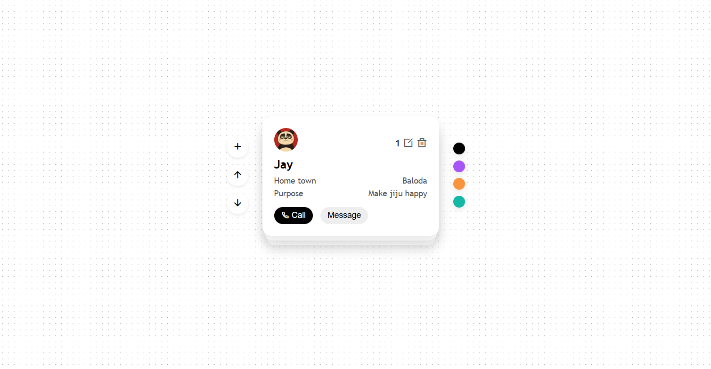

# 🃏 Animated Card Stack App

A dynamic and animated card stack interface built with **HTML, CSS, and JavaScript**, allowing users to add, edit, delete, and reorder cards with smooth transition effects. Only the top **3 cards are visible** at any time to keep the UI clean and focused.

---

## ✨ Features

- 📥 **Add new cards** with image, name, hometown, purpose, and category
- ✏️ **Edit** and update card details in-place
- 🗑️ **Delete** any card from the stack and local storage
- 🔁 **Animated Up & Down** buttons to reorder cards in the stack
- 🎯 **Only top 3 cards visible** — others are hidden automatically
- 💾 **Data stored in localStorage** for persistence
- 💡 Simple, responsive, and clean user interface

---

## 📸 Preview



---

## 🚀 Getting Started

### 1. Clone the Repository

```bash
git clone https://github.com/yourusername/animated-card-stack.git
cd animated-card-stack
